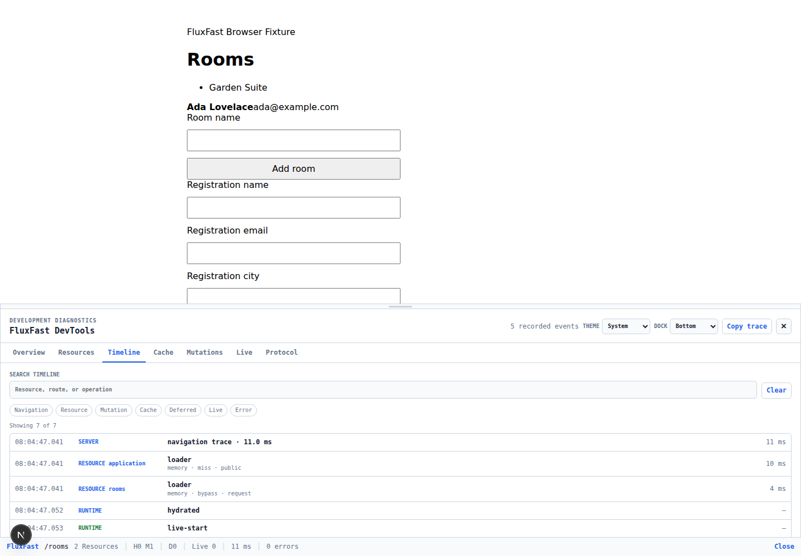

> **Version notice:** Examples follow stable **FluxFast 1.2.0**. Use matching Python and frontend packages; older 1.1 packages do not provide the React/Vite host or the new Core server/Codegen entry points. [Installation and upgrade steps](/FluxFast-Docs/version-guide/).

FluxFast DevTools is an optional development-only Debugbar for observing the
resource synchronization runtime. It answers questions such as:

- Why did this navigation load a resource instead of reusing it?
- Was a value served by the browser page cache, server cache, or loader?
- Which deferred or live update changed the resource store?
- What did a mutation patch or invalidate?
- Which browser and server events belong to the same request?

DevTools observes FluxFast. It does not fetch application data, authorize a
request, change cache state, or participate in synchronization correctness.

## Installation

Install the package as a development dependency alongside matched FluxFast
1.1 packages:

```bash
npm install @fluxfast/core@1.1.0 @fluxfast/next@1.1.0
npm install --save-dev @fluxfast/devtools@1.1.0
```

The same setup with pnpm is:

```bash
pnpm add @fluxfast/core@1.1.0 @fluxfast/next@1.1.0
pnpm add --save-dev @fluxfast/devtools@1.1.0
```

Mount `FluxDevtools` inside the application rendered by FluxFast so it can read
the active router from the existing Next.js context. No router prop is needed:

```tsx
"use client";

import {
  FluxProvider,
  resolveComponent,
  useFluxContext,
  usePage,
  type FluxApplicationProps,
} from "@fluxfast/next";
import { FluxDevtools } from "@fluxfast/devtools";
import { fluxPages } from "@/.fluxfast/pages.generated";
import { Suspense } from "react";

function CurrentPage() {
  const page = usePage();
  const { registry } = useFluxContext();
  if (!page.component) return null;
  const Page = resolveComponent(page.component, registry);
  return <Suspense fallback={null}><Page /></Suspense>;
}

export function Application({
  initialEnvelope,
  development,
  clientUrl,
  cache,
}: FluxApplicationProps) {
  return (
    <FluxProvider
      initialEnvelope={initialEnvelope}
      development={development}
      registry={fluxPages}
      clientUrl={clientUrl}
      cache={cache}
    >
      <CurrentPage />
      {process.env.NODE_ENV === "development" && <FluxDevtools />}
    </FluxProvider>
  );
}
```

Enable safe server timing metadata explicitly in the development FastAPI
application:

```python
import os

from fastapi import FastAPI
from fluxfast import FluxFast

app = FastAPI()
flux = FluxFast(app, debug=os.environ.get("APP_ENV") == "development")
```

Do not enable `debug=True` unconditionally in a production deployment. A
browser can request a trace, but only this server-side setting is authoritative.

The public package API is intentionally small:

```tsx
import {
  FluxDevtools,
  type FluxDevtoolsProps,
} from "@fluxfast/devtools";
```

`FluxDevtools` and `FluxDevtoolsProps` are stable 1.x APIs from v1.1 onward.
The store, projections, styles, protocol views, and other package files are
internal and cannot be imported through a supported package path.

| Prop | Default | Purpose |
| --- | --- | --- |
| `position` | `"bottom"` | Initial `"bottom"` or `"right"` dock. |
| `theme` | `"system"` | Initial `"system"`, `"light"`, or `"dark"` theme. |
| `defaultOpen` | `false` | Open the inspector on its first mount. |
| `maxEvents` | `500` | Bounded diagnostic history, from 1 through 5,000 events. |
| `shortcut` | `"Alt+Shift+D"` | Exact keyboard shortcut, or `false` to disable it. |

The selected panel, dock, theme, open state, and panel height are retained in
browser local storage. Those preferences do not contain runtime data.

## Development-only behavior

Diagnostics become active only while a DevTools store is subscribed. With no
subscriber, Core takes an inactive fast path and does not allocate event
objects or keep a hidden timeline. Mounting the component starts recording;
unmounting it removes the listener and live observations.

Use both safeguards shown in the installation example:

1. render the component only when `NODE_ENV` is `development`; and
2. set the Python `debug` option only for a trusted development environment.

`@fluxfast/devtools` also publishes a conditional production entry. Bundlers
that honor the standard `production` condition resolve an inert component
instead of the inspector implementation. The explicit JSX condition makes the
application intent clear and lets a production build remove even the import
path when its compiler performs constant folding.

In production, FluxFast sends no `X-FluxFast-DevTools` request header, returns
no trace header, records no diagnostic timeline, mounts no UI, and opens no
additional connection.

## Debugbar

The collapsed bar stays at the bottom or right edge of the page and summarizes
the current route, resource count, cache hits and misses, deferred resources,
live resources, latest request duration, and error count. Select the bar or
press `Alt+Shift+D` to expand it.

The expanded header provides:

- system, light, and dark themes;
- bottom and right docking;
- keyboard- and pointer-resizable bottom docking;
- a safe trace copy action; and
- a collapse action that restores focus to the Debugbar.

The tabs implement keyboard navigation with Left/Right, Home, and End. The
panel, controls, resize separator, and details disclosures use native roles and
labels so they remain usable without a pointer.



## Resources

The Resources panel combines the browser `ResourceStore` snapshot with the
latest safe server observation for each logical key. A row can show:

- key, opaque version, ready/loading/error status, and stale state;
- whether the resource currently has browser subscribers;
- loader, cache, known-version, mutation, deferred, or live source;
- server result and total/cache/loader timings;
- memory, Redis, or custom cache classification and hit/miss/bypass result;
- scope **type**, TTL, deferred flag, and live flag; and
- the most recent bounded update reason or safe error category.

Select a row for the detail view. The panel deliberately never renders the
resource value, cache key, cache tag, scope fingerprint, user ID, or tenant ID.
Use the logical key and correlation ID to locate application-owned logs when
the value itself must be inspected under that application's security policy.

## Timeline

The Timeline is the first place to look when runtime behavior is surprising.
It merges correlated observations from navigation, resource loading and
updates, page cache, prefetch, mutation, deferred work, live transport, server
traces, and lifecycle events.

```text
navigation start          correlation ff_nav_7
  transport start
  server page trace
    auth       cache-hit       0.8 ms
    rooms      loader         42.1 ms
  resource update
navigation complete
```

Filter the list by Navigation, Resource, Mutation, Cache, Deferred, Live, or
Error. Transport and lifecycle observations are assigned to those user-facing
categories. Durations use the correlated start/completion pair when available;
server phase timings are shown as a waterfall without pretending concurrent
loader durations are additive. Selecting **Clear** removes only the local
recording; it does not clear a FluxFast cache or alter application state.

When diagnosing synchronization code:

1. reproduce one operation with a cleared timeline;
2. find its navigation or mutation correlation ID;
3. inspect the related server trace and resource events;
4. compare the Resources, Cache, Mutations, Live, and Protocol panels; and
5. change the owning layer only after the evidence identifies it.

## Cache

The Cache panel separates two caches that are easy to confuse:

- **Browser page cache** observations report hit, miss, or write, source, safe
  pathname, timestamp, and correlation ID.
- **Server resource cache** observations report the backend class, lookup
  result, total/cache/loader timing, known-version omission, and whether the
  resource was sent.

A server cache hit can still coincide with a browser page-cache miss. Likewise,
`omitted-known` means the browser supplied the current opaque version and the
server omitted an unchanged value; it does not mean the resource was absent.

Redis observations expose only the backend classification `redis`. They do not
include the Redis URL, namespace, key, channel, or server internals.

## Mutations

The Mutations panel groups client transport phases and the safe server mutation
trace. It reports method, query-free path, pending/success/error result,
duration, handler/invalidation/serialization timings, patch operation names
and counts, invalidated logical keys, live publication count, redirect class,
and trace truncation.

For example, a mutation may report:

```text
POST /rooms       success       43 ms
patch rooms       append-item × 1
invalidate        roomStats
live signals      2
redirect          none
```

The panel does not contain the submitted body, patched values, item identities,
invalidation scopes, origin client ID, or redirect destination. A successful
mutation describes the server response; it is not a transaction viewer and
does not imply that every live subscriber received a signal.

## Live

The Live panel observes the existing `LiveManager`; it never opens its own
EventSource. It shows connecting, connected, disconnected, offline, connection
error, reconnect, invalidation, patch, and resynchronization activity. It also
counts reconnects, resyncs, and bounded-queue overflow recovery.

A `resync` or reconnect is expected to trigger a canonical resource read.
Follow the correlation into Timeline and Resources to confirm that the current
server value won. Redis Pub/Sub remains ephemeral: the canonical loader, not
the diagnostic event, is the source of truth after a disconnect.

## Protocol

DevTools does not change `fluxfast/1`. It uses an independent development
diagnostic protocol:

```http
X-FluxFast-DevTools: 1
X-FluxFast-DevTools-Trace: <base64url-json-without-padding>
```

The backend emits a trace only when `FluxFast(..., debug=True)` **and** the
request header is exactly `1`. The trace declares
`"protocol":"fluxfast-devtools/1"` and is decoded separately from page and
mutation envelopes.

The Protocol panel shows the query-free path, method, request type, HTTP and
diagnostic status, `fluxfast/1` identity, advertised capabilities, bounded
known-version key/version pairs, partial-resource keys, safe response counts,
trace status, correlation ID, and browser/SSR source.

Each encoded server header is capped at 7 KiB. Lower-priority rows are dropped
and `truncated` is set before the limit is exceeded. An invalid, unsupported,
or oversized trace is ignored; the application response continues normally.
See the [wire protocol specification](/FluxFast-Docs/protocol/#development-diagnostic-channel)
for the exact safe fields and compatibility rules.

## SSR

The initial document request happens before a browser subscriber can exist.
In development, the Next server opts into the trace, validates it with the same
bounded decoder, and passes it to `FluxRoot` as separate development metadata.
The provider publishes that one safe trace followed by a hydration marker when
DevTools subscribes.

This bootstrap happens exactly once even under React StrictMode. It is not part
of `PageEnvelope`, does not alter hydration data, strips the query string from
the displayed path, and is absent from production rendering.

## Security

DevTools is safe metadata, not a permission boundary. Keep normal development
environments private and retain application authentication and authorization.

Allowed observations include logical resource keys, scope types, TTLs, fixed
cache and error categories, timing, patch operation names, invalidated keys,
counts, safe paths, opaque versions, and correlation identifiers.

The runtime excludes:

- resource values and mutation/request bodies;
- cookies, authorization and CSRF headers, or arbitrary custom headers;
- scope fingerprints, user/tenant IDs, cache keys, cache tags, or client IDs;
- Redis, database, or other connection URLs;
- query strings, arbitrary exception messages, and tracebacks; and
- patch values, item identities, broker topics, or redirect destinations.

**Copy trace** serializes the same bounded, value-free projections already
visible in the UI as `fluxfast-devtools-export/1`. Review any diagnostic file
under the application's own disclosure policy before sharing it. Do not work
around the exclusions with ad-hoc console logging of protected values.

## Performance

The default store retains at most 500 diagnostic events. `maxEvents` can lower
that bound or raise it to a hard maximum of 5,000. Cache, mutation, live, and
protocol projections apply their own smaller display bounds, and the backend
trace has independent row and byte limits.

The v1.1 release gate verifies:

- inactive runtime overhead against v1.0.1 in both benchmark orders, blocking
  only a repeatable regression above 1% after measured noise;
- 1,000 navigations, 1,000 resource updates, 500 mutations, and 100 live
  reconnect cycles with the event ring at or below its configured bound;
- a safe serialized trace at or below 2 MiB and retained heap at or below
  32 MiB for that stress workload;
- no listener or live-connection leak after cleanup; and
- a production Next.js build with no DevTools UI marker and no more than a
  512-byte route-size delta between equivalent consumers.

These are regression gates, not promises that opening a developer inspector is
free. Close or unmount DevTools during unrelated profiling and choose a smaller
`maxEvents` for unusually event-heavy development sessions.

## Troubleshooting

### The bar does not appear

Confirm that `@fluxfast/devtools`, `@fluxfast/next`, and `@fluxfast/core` are
compatible 1.1 versions; the component is inside the FluxFast application
provider; `NODE_ENV` is `development`; and the component was not rendered on a
server-only branch. Run `npx fluxfast doctor` for adapter and generated-registry
problems.

### Browser events appear but server timings are missing

Set `FluxFast(app, debug=True)` only in the development backend and verify that
the browser request contains `X-FluxFast-DevTools: 1`. A proxy must preserve the
request and response headers within its ordinary header-size policy. Missing,
invalid, or unsupported traces are shown as such and never fail the request.

### The trace says `truncated`

The 7 KiB response bound was reached. The application response is complete;
only lower-priority diagnostic rows were omitted. Reproduce a narrower partial
resource load or use Timeline correlations with application metrics.

### The production bundle still imports the package

Keep the explicit `NODE_ENV` JSX guard, use a production build that selects the
standard `production` export condition, and inspect the built route rather than
the source dependency graph. The production entry returns `null`, but a custom
bundler that ignores conditions may retain unreachable source bytes.

### The shortcut does not work

The match uses the exact modifier combination. Check browser/OS shortcut
conflicts, set another modifier-based value such as `"Control+Shift+D"`, or
pass `shortcut={false}` and use the bar directly.

### The panel reports an internal error

The error boundary disables only DevTools; FluxFast application behavior keeps
running. Capture the browser console message, package versions, safe copied
trace if available, and the smallest reproduction when reporting the issue.
